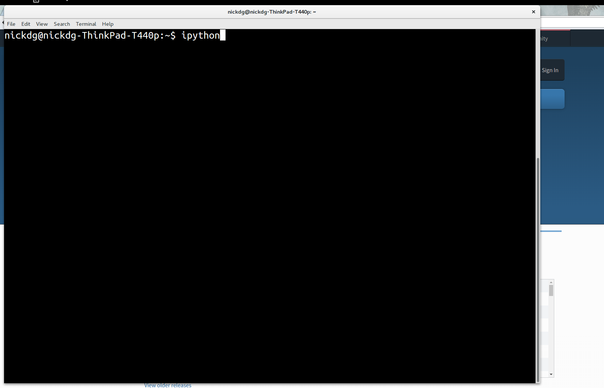

# Micro-Workshop 1: Introduction to Python with Turtle Graphics

## Workshop Description

**Duration**: 45-60 Minutes

**Target Audience**: Complete Beginners, ages 8-80

**Recommended Class Size**: Flexible, accomodates any size class, although best if at least every pair of students has a robot
to themselves for experimentation at the end.

**Learning Goals**:

  - Become familiar with Python's main syntax, including:
    - Variable Assignment and Operators
    - Functions and Methods
    - Importing Modules
  - Write a working Python Script
  - Successfully Use Python to:
    - Solve Math Problems
    - Draw Pictures
    - Control Robots


## Installing and Running Python

Python comes built-in with Linux and Mac, but it's best if it's installed from the Python Web Page https://www.python.org/downloads/

*Note*: The newest version of Python (Python 3) is recommended, but either version wil work for this workshop.

*Note*: We're going to use a terminal program called **ipython** ("Interactive Python") for this course, which has a few extra features
to make it easy to learn Python.

*After Installing Python: To Run Python*:
  1. Open a terminal program:
    - Mac: Open Spotlight Search (apple+space) and type "Terminal".  This program will launch.
    - Linux: Use the Keyboard shortcut Ctrl+Alt+T, or open the program "Terminal"
    - Windows: Open the program called "Command Window" or "Powershell Terminal"

  2. Install ipython by typing **pip install ipython**.  This will automatically download and install the program for you!

  3. Run the iPython Interactive REPL (Command-Line Interface), by typing: **ipython** and pressing the enter key.



That's it! You're now in Python, one of the most popular general-purpose proramming languages in the world.

## Programming-Language-As-Calculator

Let's try doing the first thing everyone does when using computers: making math easier by using them as calculators!

Try using Python to solve these math problems:

### Math Exercises

   1. What is 1 + 1?
   2. What is 8 * 32?
   3. Let's make x = 7.
       - What is x * 5?
       - x * 32?
       - x / 3.2?
       - x + 555?
   4. Let's make apples = 8, pears = 10, and bananas = 12.
       - What is pears * apples?
       - apples + bananas?
       - bananas + apples?
       - apples * 3 + pears?
  

To make Python do more, we need to **import** modules.  These will give Python new **functions**.

Let's give Python more advanced math functions by importing the **math** module.  Enter the following into Python:

```python
import math
```
Now the math module is loaded! To get access to the abilities inside the math package, you need to use the **dot (.)**:

```python
math.sqrt(x)  # the square root of x
math.sin(x)  # The sine of x
math.exp(x)  # the exponent of x (e to the x'th power)
```
Notice the pattern above:  **PackageName.FunctionName(InputName)**.

To see a list of all the functions available in the math module, type:

```python
dir(math)
```

To read what a function does, use the **help** function, like so:

```python
help(math.sqrt)
```

To exit the help text, simply type the letter "**q**"

*Note*: Don't worry if you don't understand everything yet--that will come!

### Math Module Exercises

Answer the following questions:

  1. What is the square root of 32?
  2. What is the cosine of 1.72?
  3. what is the 5th digist of pi?
  4. What is the log of 18271?
  5. What is the log of the cosine of the square root of pi?


## Drawing with Turtle Graphics

The **turtle** module is a drawing application where you move Alex the **Turtle** around the screen.  Alex has a pen tied to his tail, and he leaves a trail wherever he goes!

To use this package, first, import it, then use these two lines to make alex the turtle::

```python
import turtle
alex = turtle.Turtle()
```

Alex can do lots of things.  He can move **forward** some distance, for example::

```python
alex.forward(100)
```

He can do other things, to!  Let's take some time now and use the skills you've learned so far to figure out what kinds of things you can do with Alex!

*Hint*: The **dir()** function will work on Alex, too.

### Turtle Graphics Exercises

  1. Make a Triangle
  2. Make a Bigger Triangle.
  3. Make a Square.
  4. Change the color of the turtle's pen.
  5. Make a second turtle, and set his starting position to (10, 20), where he should draw a triangle, too.
  6. Clear the Screen.  (Hint: it is a function in the **turtle** module, not part of Alex.)

## Saving Time with For Loops

You tell Python to repeat some lines of code multiple times using the **for** statement.  Here's how to print the same command 3 times:

```python
for num in [1, 2, 3]:
    print(num)
```
Let's break that code down:

   1. **[1, 2, 3]**: This is a *list* of numbers.  The more items in the list, the more times the code will run.
   2. **The "for num in list:" statement**:  This tells Python that you want to repeat some code.  It also creates a new variable, called *num*.  The colon (**:**)is really important; you need it at the end of the **for** statement for it to work.
   3. **print(num)**  This is the code that will be repeated.  *Important*: notice that there are some spaces before the code; Python needs these spaces to know that they go inside the **for** loop.


### For-Loop Exercises

  1. Print "Hello World" 3 times in a loop!
  2. Print your name 5 times in a loop!
  3. Use a Turtle to draw a triangle in a loop.
  4. *Challenge:* Use a for-loop inside a for-loop to draw 5 squares, each inside another!


## Control a RoboTurtle

Let's connect to a robot and control it with Python!  We'll use our very own **roboturtle** module to connect up to some
robots over our network and control them using the same commands that we used for **turtle**!

  1. Exit ipython by typing Ctrl-D.
  2. Install the roboturtle module:

```
pip install roboturtle
```

  3. Launch ipython again:

```
ipython
```

  4. import the turtle and roboturtle modules, and connect a **turtle.Turtle** to the network by making a client, then binding it to the Turtle:

```python
import roboturtle
client = roboturtle.EchoClient(ip='192.100.10.10', port=8000)  # Fill in the ip and port numbers with those given by the instructor for your robot.

import turtle
alex = turtle.Turtle()  # Makes a turtle

client.bind(alex)  # Connects the Turtle to the network
alex.forward(100)  # Moves the robot!
```

### RoboTinker Session:

Let's do some free play with your RoboTurtle!  For some ideas:

  1. Make your RoboTurtle navigate an obstacle course!
  2. Play football!  First Robot to score a goal wins!
  3. Draw a Picture!  Attach a marker to the turtle and have it draw a nice picture on a large sheet of paper!


## Wrap-Up

That's it for Lesson 1! By now, you should be getting comfortable with typing commands in Python, and have some ideas of what Python can do!
In this lesson, we've covered:

  - Installing Python on your Machine  (From the website)
  - Variable Assignment and Math Operators (x = 3 + 2)
  - Installing and Importing Python Modules (pip install roboturtle, import roboturtle)
  - Object Instantiation (alex = turtle.Turtle())
  - Function- and Method-calling (math.sqrt(16), alex.forward(100))
  - For-Loops (for side in [1, 2, 3]:)

Please review this material at home--next time, we'll learn how to do even more, including writing our own functions,
and even our own programs!
